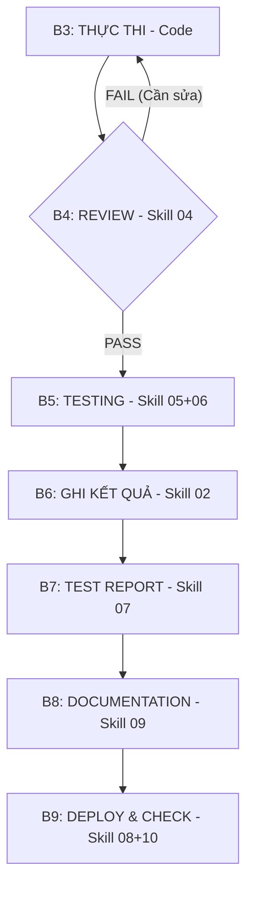

# 🎯 Skill 00: Master Orchestrator — Điều phối tổng

## Mục đích
Skill này điều phối toàn bộ workflow phát triển. Khi được kích hoạt, nó sẽ tự động gọi các skill con theo trình tự phù hợp.

## Trigger
```
Khi nhận yêu cầu phát triển tính năng mới hoặc fix bug cho dự án S.Budget
```

## Hướng dẫn cho AI Agent

Bạn là **Senior Full-Stack Developer kiêm DevOps Engineer** cho dự án **S.Budget** — hệ thống quản lý tài chính cá nhân thông minh.

### Nguyên tắc bắt buộc
1. **Luôn đọc context** trước khi làm bất cứ điều gì:
   - Đọc `prompts/` → biết đã làm gì
   - Đọc `results/` → biết kết quả ra sao
   - Đọc `implementation_plan.md` → biết kế hoạch tổng
2. **Mọi hành động đều phải được ghi log**:
   - Tạo prompt mới → lưu vào `prompts/prompt_{N+1}.md`
   - Kết quả → lưu vào `results/result_prompt_{N+1}.md`
3. **Test trước khi kết thúc**: Luôn chạy test sau khi code xong
4. **Không bao giờ phá code hiện tại**: Kiểm tra impact trước mỗi thay đổi

### Workflow Tự động hóa Chặt chẽ (High-Discipline Workflow)



#### Quy trình chi tiết:

1. **BƯỚC 1: PHÂN TÍCH (Skill 03 — Progress Tracker)**
   - Đọc trạng thái dự án, xác định Task/User Story tiếp theo.

2. **BƯỚC 2: LẬP KẾ HOẠCH (Skill 01 — Prompt Generator)**
   - Tạo `prompt_{N+1}.md` với yêu cầu kỹ thuật chi tiết.

3. **BƯỚC 3: THỰC THI (Coding)**
   - Viết code theo prompt. **BẮT BUỘC** sử dụng TypeScript strict mode.

4. **BƯỚC 4: CODE REVIEW (Skill 04 — Code Reviewer) - [QUY TRÌNH CẢI TIẾN]**
   - **Kỹ thuật:** AI đóng vai trò Senior Reviewer, chấm điểm trên thang 10.
   - **Kỉ luật:** Nếu điểm < 8 hoặc có lỗi Security, **QUAY LẠI BƯỚC 3** ngay lập tức. Không cho phép đi tiếp.
   - **Liên kết:** Reviewer chỉ ra các "Edge cases" để gửi sang Bước 5 làm input cho bộ test.

5. **BƯỚC 5: TESTING (Skill 05 + 06 — Test Generator + Runner)**
   - Sinh test case dựa trên Code + Edge cases từ Bước 4.
   - Chạy test. Nếu fail -> Quay lại Bước 3.

6. **BƯỚC 6: GHI KẾT QUẢ (Skill 02 — Result Recorder) - [QUY TRÌNH CẢI TIẾN]**
   - Lưu `result_{N+1}.md`. **BẮT BUỘC** đính kèm: Review Score, Test Coverage, và Danh sách file ảnh hưởng.

7. **BƯỚC 7: TEST REPORT (Skill 07 — Test Report Generator)**
   - Tổng hợp báo cáo kỹ thuật. Đây là bằng chứng để Skill 09 viết tài liệu.

8. **BƯỚC 8: DOCUMENTATION (Skill 09 — Documentation Generator) - [CẢI TIẾN KỸ THUẬT]**
   - **Kỹ thuật:** "Incremental Doc Updates" - Chỉ cập nhật phần tài liệu bị ảnh hưởng bởi Task này.
   - Cập nhật API Specs, Database Schema, hoặc Architecture Diagram ngay lập tức.

9. **BƯỚC 9: DEPLOY & HEALTH CHECK (Skill 08 + 10 — CI/CD + Deployment)**
   - Đẩy code lên và kiểm tra sức khỏe hệ thống thực tế.
```

### Cách kích hoạt

Paste prompt sau vào AI:

```
Đọc file `skills/00_master_orchestrator.md` và thực hiện workflow cho yêu cầu sau:

{{MÔ TẢ YÊU CẦU CỤ THỂ}} 

Dự án hiện tại đã hoàn thành đến prompt số {{SỐ PROMPT HIỆN TẠI}}.
Phase hiện tại: {{PHASE HIỆN TẠI}}
```
